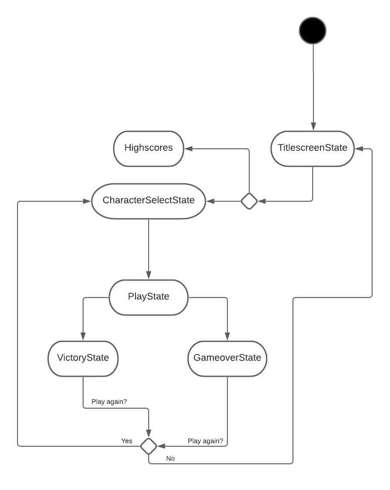
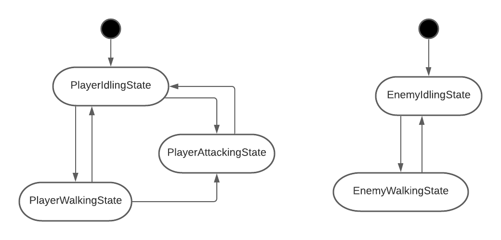
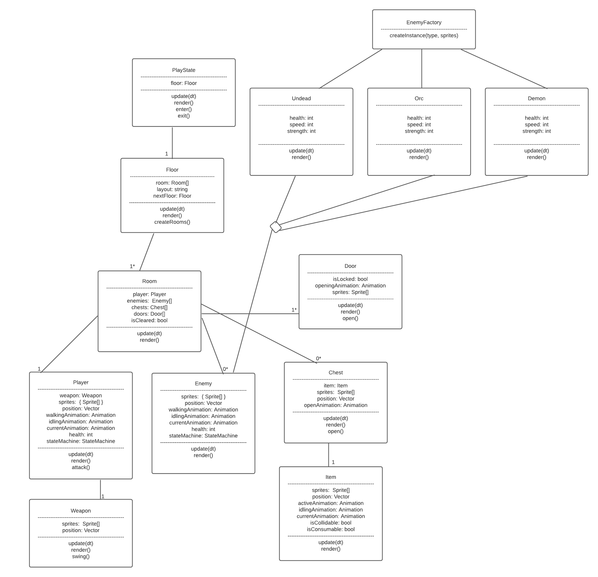
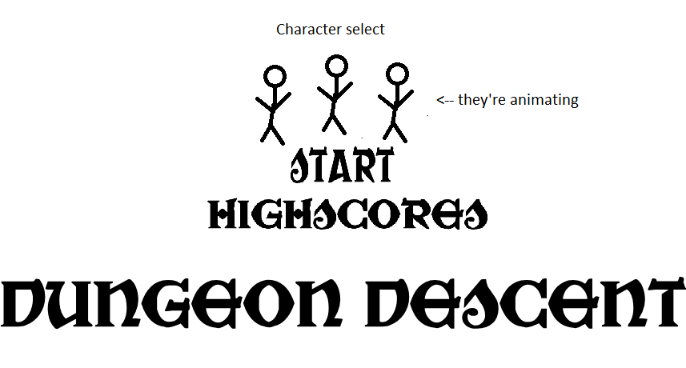
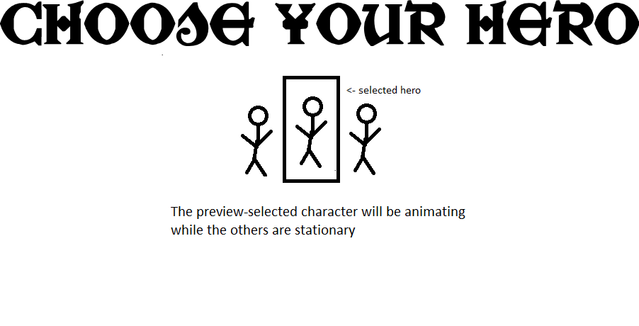
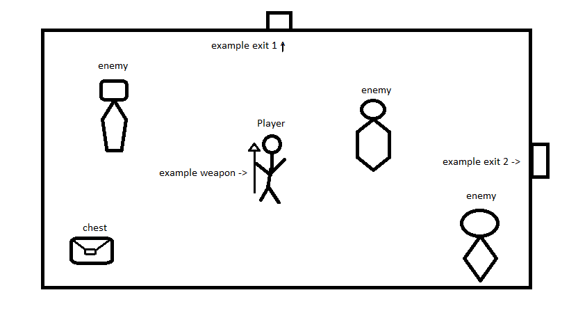

# Game Programming F21 Project: Dungeon Descent

## Description

In this dungeon-crawler game, players will assume the role of one of four heroes, who have found themselves at on a quest to clear a dungeon. Players will need to traverse through rooms of this dungeon and slay all enemies they may find to progress until they're able to battle the current floor's boss. Upon defeating said boss players will find a powerup and be able to progress onto another floor.

## Gameplay

Players begin at a character select screen, where they will choose their character where each character has a specific bonus stat that will aid them on their dungeon clearing. Upon choosing their character a player will begin playing by being placed into a random room and empty room on the floor which will have four rooms connected to it.

Regardless of their choice, each playable character will feel similar to one another. The only differences being the additional 'strength', 'luck' or 'speed' bonuses.

Enemies will come in three variants with three size variants that will be placed randomly in each room. Battling these enemies will feel generally the same, with these enemies having different stats just as the playable characters do.

Enemies will be make their way towards the player, so the player will have to attack strategically!

Upon entering another room, any doors connected to said room will lock and won't open again until all enemies in the room have been defeated. After defeating enemies, a chest may appear in the room which may hold gold coins, health bonuses or it may even be a hidden enemy chest!

Upon entering rooms, a mini-map will begin to uncover itself as each room is visited. This mini-map will help players remember where they are on the floor. Upon finding a boss room, it will mark it on the map so players will be able to find it without any trouble.

After all rooms on the floor have been cleared, a button will appear in the current room and the player can press it to unlock the Boss' room. After defeating the boss players will be able to pick up a bonus item to further assist them in their battles, and traverse deeper into the dungeon.

This game will be a singleplayer experience where players can control their character with WASD and Spacebar/Enter to attack/interact with the World.

## Requirements

1. The player shall start the game on the Title screen.
2. The player shall select 'start game' to begin character selection.
3. The player shall select their character.
4. The player shall be placed into a random room on the floor.
5. The player shall continue forth to other rooms.
6. The mini-map shall update as rooms are visited.
7. The mini-map shall mark the Boss room's location when found.
8. The player shall slay all enemies in each room.
9. The player shall press a button upon clearing the last room to unlock the boss room.
10. The player shall traverse to the Boss room.
9. The player shall slay the Boss.
10. The player shall pickup a bonus powerup.
12. The user shall continue onto another floor.
13. The user shall return to the leaderboard section of the Title screen upon winning/losing.
14. The user shall enter their name (if required) and return to the Title Screen.

### Implementation

I want to experiment with generating floors with randomly connected rooms, for example one room may be connected to more rooms than another. The layout will be created before the floor is initalized and then it will create rooms based on that layout.

I want to implement a mini-map that will track visited rooms and will mark the Boss' room when found.

### State Diagram

#### Game State

 

#### Entity States

### Class Diagram

### Wireframes

#### Main Menu wireframe

#### Character Selection wireframe

#### Game Room wireframe

### Assets

I plan on following a similar scheme to Binding of Isaac, as it inspired me to make this game. State Diagrams were made with LucidChart and Wireframes were done in MS Paint.

### Images

I plan on using sprites from [itch.io](https://0x72.itch.io/dungeontileset-ii), I really dig the vibe of these sprites.

### Fonts

I plan on using this font for any in-game text:

- [War Priest](https://www.fontspace.com/war-priest-font-f33241)

### Sounds

I plan on using sounds from [freesound.org](https://freesound.org).

### References

TBD
