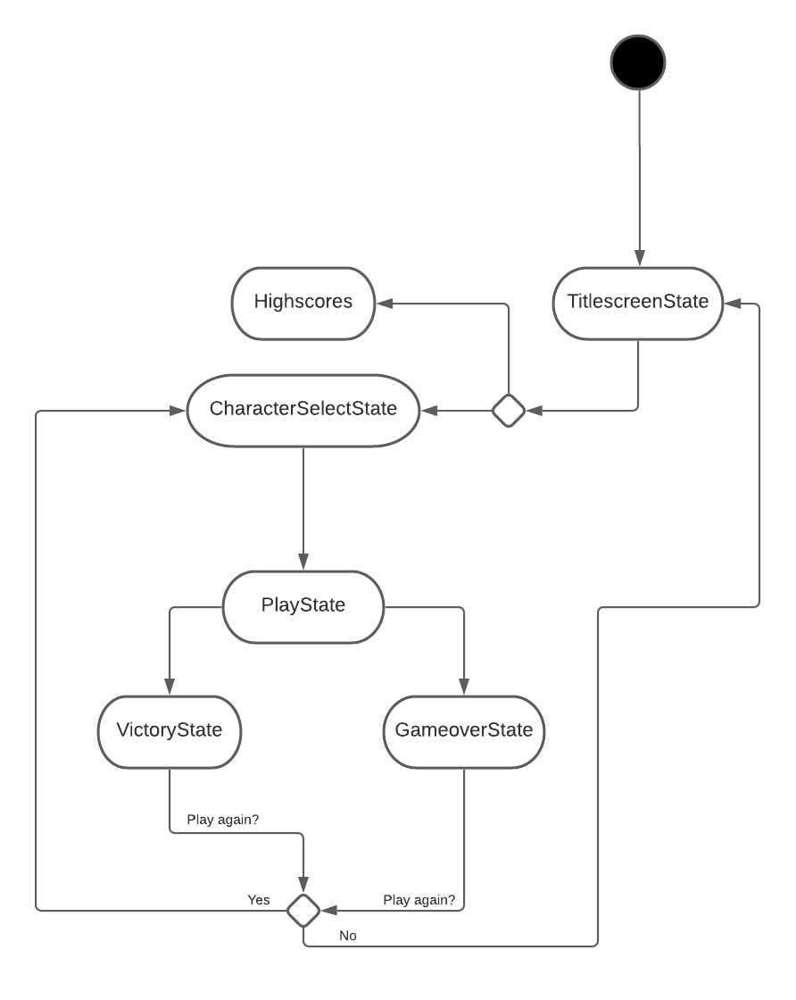
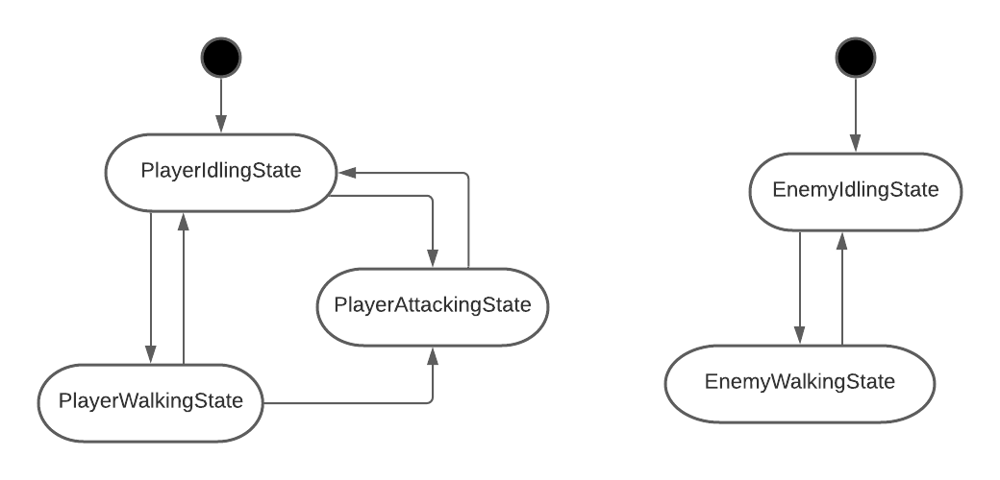
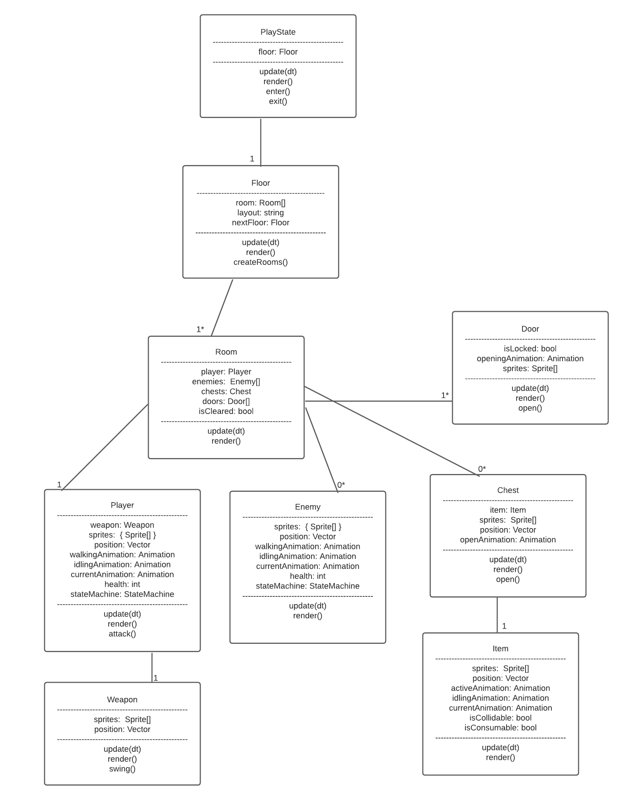
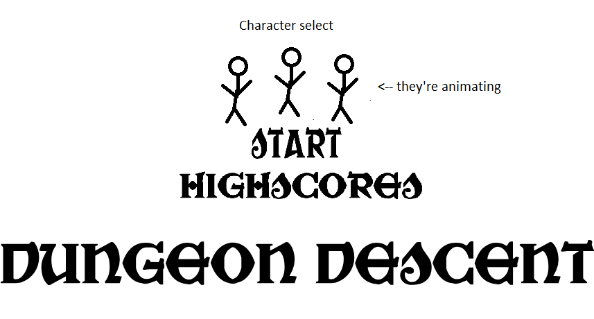
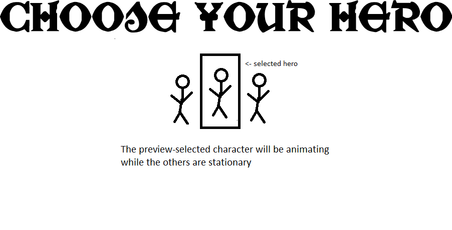
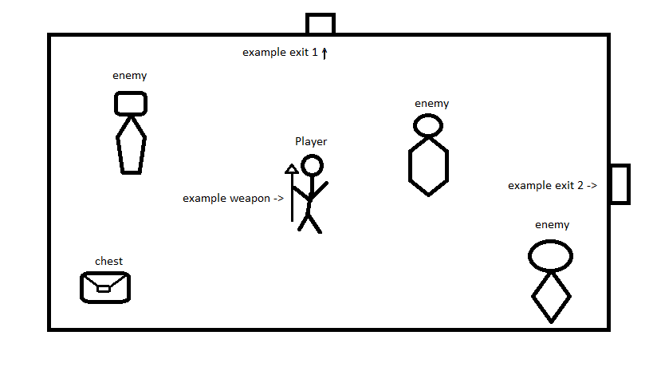

# Game Programming F21 Project: Dungeon Descent

## Description

In this dungeon-crawler game, players will assume the role of one of four heroes, who have found themselves at on a quest to clear a dungeon. Players will need to traverse through rooms of this dungeon and slay all enemies they may find to progress until they're able to battle the current floor's boss. Upon defeating said boss players will find a powerup and be able to progress onto another floor.

## Gameplay

Players begin at a character select screen, where they will choose their character and begin playing by being placed into a random room on the floor where there will be a random weapon spawn for a player to pick up and begin playing.

Upon picking up the weapon the doors in the current room will open, allowing players to explore. Upon entering another room, the doors will lock and won't open again until all enemies in the room have been defeated. After 
all rooms on the floor have been cleared, a button will appear and the players can press it to unlock the Boss' room. After defeating the boss players will be able to traverse deeper into the dungeon.

This game will be a singleplayer experience where players can control their character with WASD and Spacebar/Enter.

## Requirements

1. The user shall start the game on the Title screen.
2. The user shall select 'start game' to begin character selection.
3. The user shall select their character and begin in a random room with a random weapon.
4. The user shall pickup this weapon.
5. The user shall continue forth to other rooms.
6. The user shall slay all enemies in each room.
7. The user shall press a button upon clearing the last room to unlock the boss room.
8. The user shall slay the boss.
9. The user shall pickup a powerup.
10. The user shall continue onto another floor.
11. The user shall return leaderboard section of the titlescreen upon losing.
12. The user shall enter their name (if required) and return to the titlescreen.

### Implementation

I want to experiment with generating floors with randomly connected rooms, for example one room may be connected to more rooms than another. The layout will be created before the floor is initalized and then it will create rooms based on that layout.

### State Diagram

#### Game State

 

#### Entity States

### Class Diagram

### Wireframes

#### Main Menu wireframe

#### Character Selection wireframe

#### Game Room wireframe

### Assets

I plan on following a similar scheme to Binding of Isaac, as it inspired me to make this game. State Diagrams were made with LucidChart and Wireframes were done in MS Paint.

### Images

I plan on using sprites from [itch.io](https://0x72.itch.io/dungeontileset-ii), I really dig the vibe of these sprites.

### Fonts

I plan on using this font for any in-game text:

- [War Priest](https://www.fontspace.com/war-priest-font-f33241)

### Sounds

I plan on using sounds from [freesound.org](https://freesound.org).

### References

TBD
